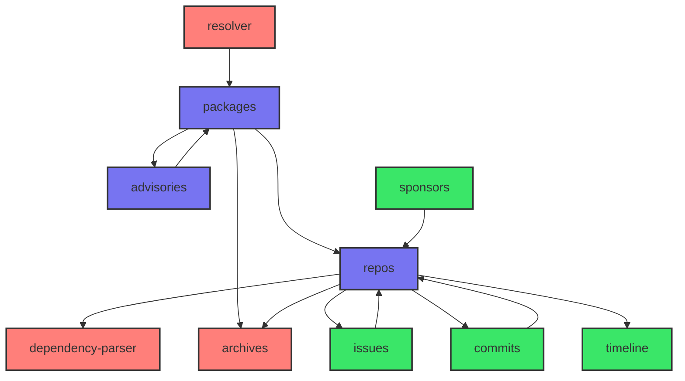

```mermaid
graph TD;

		packages
		advisories
		repos

		commits
		issues
		sponsors
		timeline

    advisories-->packages;

    packages-->advisories;
    packages--->repos;
    packages--->archives;

		repos-->dependency-parser;
		repos-->archives;
		repos-->issues;
		issues-->repos;
		repos-->commits;
		commits-->repos;

		repos-->timeline;

		sponsors-->repos;

		resolver-->packages;

		click packages "/docs/services/data-services/packages"
		click advisories "/docs/services/data-services/advisories"
		click repos "/docs/services/data-services/repositories"

		click commits "/docs/services/indexes/commits"
		click issues "/docs/services/indexes/issues"
		click sponsors "/docs/services/indexes/sponsors"
		click timeline "/docs/services/indexes/timeline"

		click archives "/docs/services/tools/archives"
		click dependency-parser "/docs/services/tools/dependency-parser"
		click resolver "/docs/services/tools/resolver"

		classDef indexes fill:#3AE668,stroke:#333,stroke-width:2px;
		classDef data-services fill:#7774F1,stroke:#333,stroke-width:2px;
		classDef tools fill:#FF7F7A,stroke:#333,stroke-width:2px;

		class packages,advisories,repos data-services
		class commits,issues,sponsors,timeline indexes
		class archives,dependency-parser,resolver tools

		%%science
		%%summary-->packages;
		%%summary-->repos;
		%%summary-->timeline;
		%%funds-->opencollective;
		%%funds-->sponsors;
		%%dashboards-->packages;
		%%dashboards-->repos;
		%%dashboards-->dependabot;
		%%dependabot-->repos;
		%%dependabot-->issues;
		%%dependabot-->advisories;
		%%dependabot-->packages;
    %%docker-->packages;
    %%packages------->npm;
    %%packages------->conda;

```
